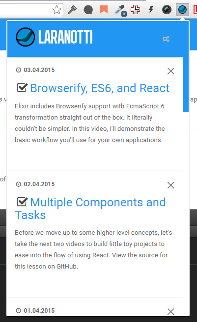

# Laranotti


Install from [Google Chrome store page](https://chrome.google.com/webstore/detail/laracasts-notifier/aidlbngabkfmnfmfjgnmfhihjcpdbbjo)

I have opened a topic on [Laracasts forum](https://laracasts.com/discuss/channels/general-discussion/laracasts-notifier-extension-for-google-chrome) for discussions.

If you are going to tweet about it please use `#Laranotti` and help me spread the news, thank you.

## Description

This extension fetches and notifies you of latest lessons from [Laracasts](https://laracasts.com) in your Google Chrome browser.

**Laranotti checks for new lessons every 60 minutes from my [API](https://github.com/mabasic/laracasts-feed) which caches the response for 30 minutes :)**

## Features

- Fetches latest lessons from Laracasts
- Mark lesson as watched or unwatched
- Mark all lessons as watched
- Manually fetch lessons from Laracasts
- Extension badge notifies the user how many unwatched lessons he has
- Desktop notifications [**NEW**]
- Background events [**NEW**]
- Automatically fetch new lessons from Laracasts [**NEW**]
- Detects when you have closed the tab of the lesson you were watching and marks it as watched [**NEW**]

## Screenshots



## For development

I am using Laravel Elixir, so you can use it like so:

One time run:

```
gulp
```

Run and watch for changes:

```
gulp watch
```