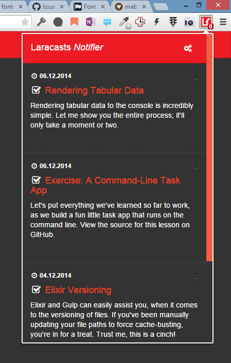

# Laracasts Notifier


## Description

This extension fetches and notifies you of latest lessons from [Laracasts](https://laracasts.com) in your Google Chrome browser.

Lessons and their state are synced across PC's so that you never have to keep log of watched or unwatched lessons.

**This extension checks for new lessons every 60 minutes from my [API](https://github.com/mabasic/laracasts-feed) which caches the response for 30 minutes :)**

## Features

- Fetches latest lessons from Laracasts
- Mark lesson as watched or unwatched
- Mark all lessons as watched
- Manually fetch lessons from Laracasts
- Syncs across PC's using Google Chrome storage
- Extension badge notifies the user how many unwatched lessons he has
- Desktop notifications [**NEW**]
- Background events [**NEW**]
- Automatically fetch new lessons from Laracasts [**NEW**]
- Detects when you have closed the tab of the lesson you were watching and marks it as watched [**NEW**]

## Screenshots



## For development

I am using Laravel Elixir, so you can use it like so:

One time run:

```
gulp
```

Run and watch for changes:

```
gulp watch
```

> I have extended Elixir to work with React.js. Check `gulpfile.js` to view what is included.