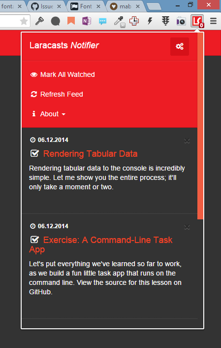
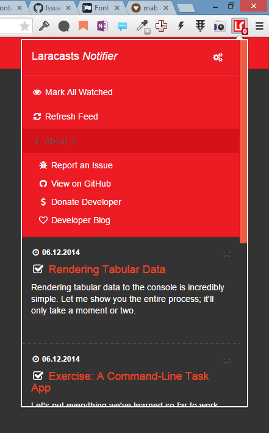
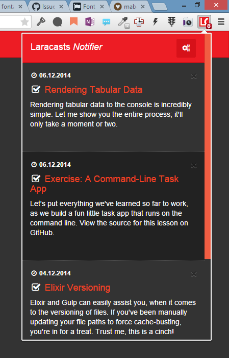

# Laracasts Chrome Extension

*+Work in progress ... readme will be updated soon.**

## Description

This extension fetches and notifies you of latest lessons from [Laracasts](https://laracasts.com) in your Google Chrome browser.

**You get a desktop notification when a new lesson is released.** You can then decide to watch it or mark it as watched.

Lessons and their state is synced across PC's so that you never have to keep log of watched or unwatched lessons.

## Features

- Fetches latest lessons from Laracasts
- Mark lesson as watched or unwatched
- Mark all lessons as watched
- Manually fetch lessons from Laracasts
- Syncs across PC's using Google Chrome storage
- Extension badge notifies the user how many unwatched lessons he has

## Still missing features

- [ ] Desktop notifications
- [ ] Background events
- [ ] Automatically fetch new lessons from Laracasts _(This is done, but not yet implemented because of the development status of the extension)_

## Screenshots

